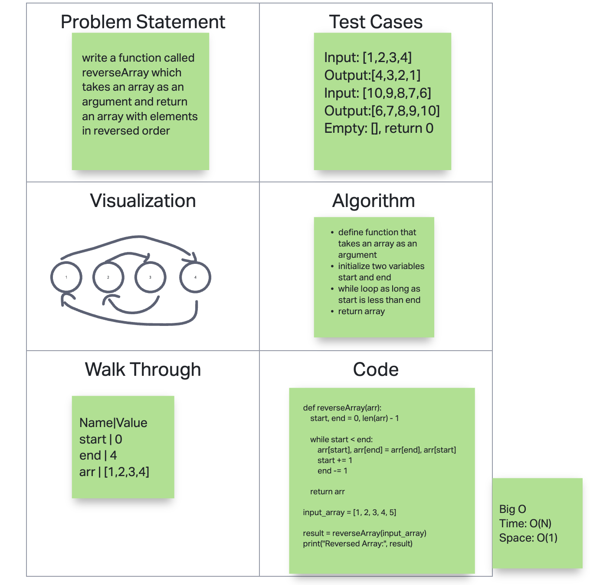
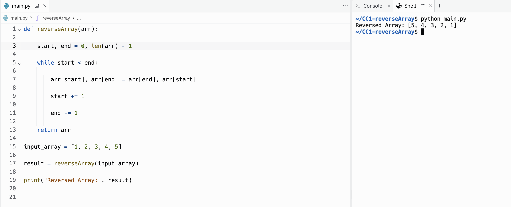

# Reverse Array

Write a function called reverseArray which takes an array as an argument. Without utilizing any of the built-in methods available to your language, return an array with elements in reversed order.
whit
## Whiteboard Process
<!-- Embedded whiteboard image -->

## Approach & Efficiency

1. Write out problem statement
2. Then wrote a function that would that array as argument
3. Initialize two variables start and end
4. While loop that runs as long as start is less than end
5. Return array
6. The Big O time is O(N) and space is O(1)

## Solution

[Link to code](https://replit.com/@XinDeng/code-challenges-401)
