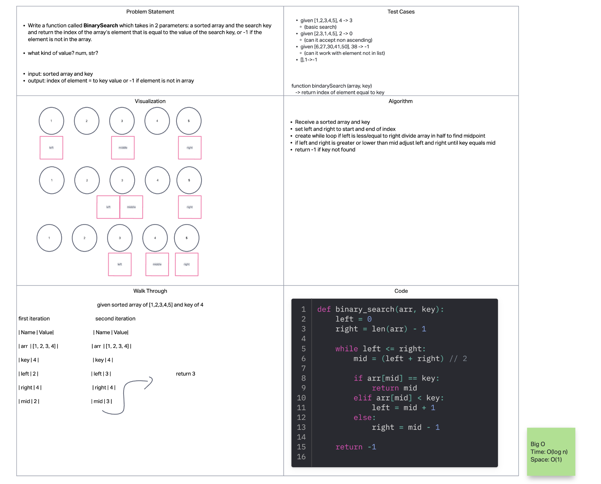

# Reverse Array

- Write a function called BinarySearch which takes in 2 parameters: a sorted array and the search key. Without utilizing any of the built-in methods available to your language, return the index of the array’s element that is equal to the value of the search key, or -1 if the element is not in the array.
- NOTE: The search algorithm used in your function should be a binary search.

## Whiteboard Process
<!-- Embedded whiteboard image -->

## Approach & Efficiency

1. Write out problem statement
2. Looked at past challenge that used middle split
3. wrote test cases with given and output
4. wrote algorithm that follows basic test case
5. drew image that follows that algorithm
6. wrote solution on replit
7. The Big O time is O(log n) and space is O(1)

## Solution

[Solution](solution3.py)

[Link to code](https://replit.com/@XinDeng/code-challenges-401)
