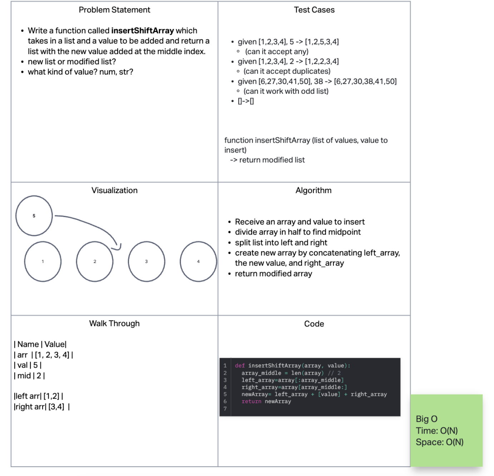
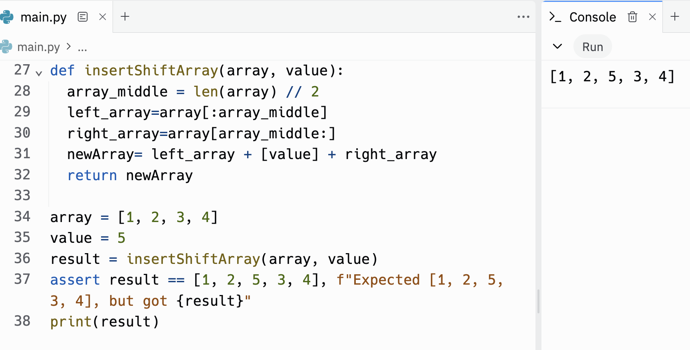

# Reverse Array

Write a function called insertShiftArray which takes in an array and a value to be added. Without utilizing any of the built-in methods available to your language, return an array with the new value added at the middle index.

## Whiteboard Process
<!-- Embedded whiteboard image -->

## Approach & Efficiency

1. Write out problem statement
2. Then wrote a function that would take an array and value to insert
3. divide array in half to find midpoint
4. split list into left and right
5. create new array by concatenating left_array, the new value, and right_array
6. return modified array
7. The Big O time is O(N) and space is O(N)

## Solution

[Link to code](https://replit.com/@XinDeng/code-challenges-401)
