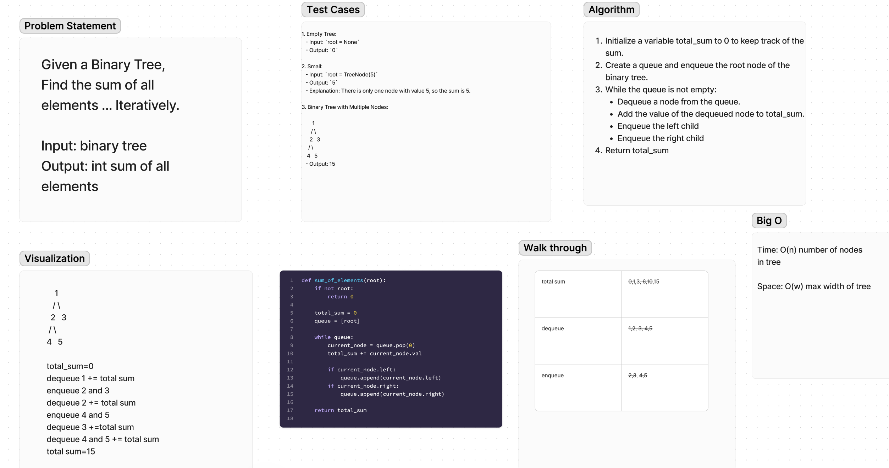

# Graph Breadth First 

Given a Binary Tree, Find the sum of all elements ... Iteratively.

## Whiteboard Process

  <!-- Embedded whiteboard image -->

[DSA Practice](https://codefellows.github.io/dsa-practice/)

## Approach & Efficiency

1. Write out problem statement
2. write test cases
3. drew diagram
4. The Big O Time: O(n) number of nodes in tree. Space: O(w) max width of tree

## Solution

[Solution](../../docs/binary-tree-sum/solution36.py)
