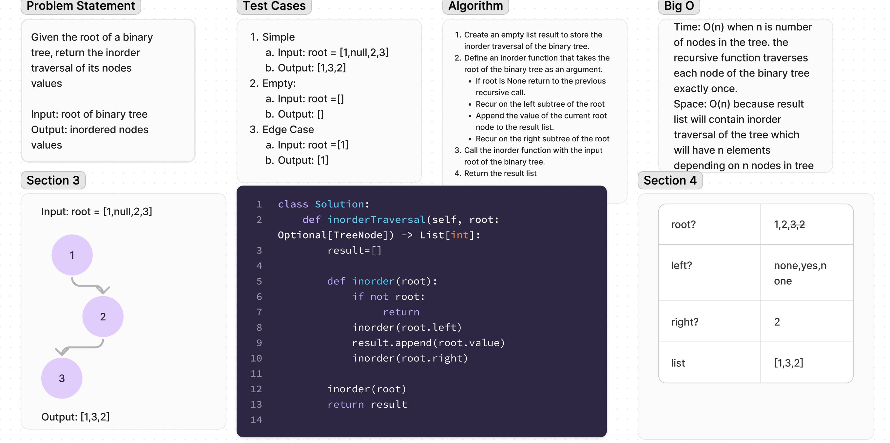

# Binary Tree Inorder Traversal

Given the root of a binary tree, return the inorder traversal of its nodes' values.

## Whiteboard Process

  <!-- Embedded whiteboard image -->

## Approach & Efficiency

1. Write out problem statement
2. write test cases
3. drew diagram
4. The Big O Time: O(n) number of nodes in tree. Space: O(n) number of nodes in the tree 

## Solution

[Solution](../../docs/cc-41/solution41.py)
