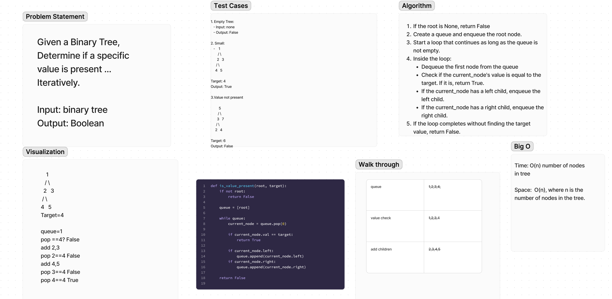
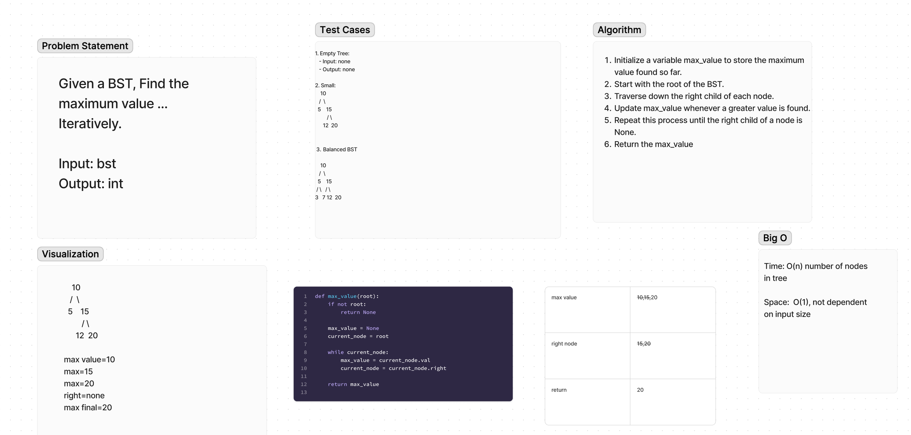

# Graph Breadth First 

1. Given a Binary Tree, Determine if a specific value is present ... Iteratively.
2. Given a BST, Find the maximum value ... Iteratively.

## Whiteboard Process

  <!-- Embedded whiteboard image -->

## Approach & Efficiency

1. Write out problem statement
2. write test cases
3. drew diagram
4. The Big O Time: O(n) number of nodes in tree. Space: O(w) max width of tree

## Solution

[Solution](../../docs/computational-thinking/lab36.py)
