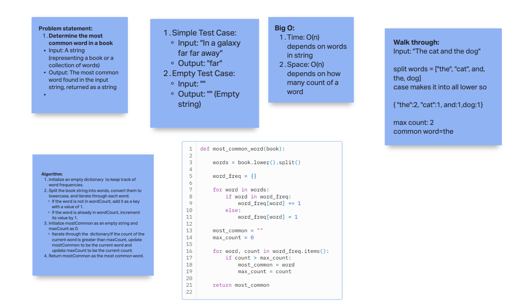

# Hashtable Most Common Word Mock Interview

[Interview Question](https://codefellows.github.io/common_curriculum/data_structures_and_algorithms/Code_401/class-34/interview-01.html)

## Whiteboard Process

  <!-- Embedded whiteboard image -->

  

## Approach & Efficiency

## Solution

[Solution](../../docs/hashtable_most_common_mock/solution34.py)

