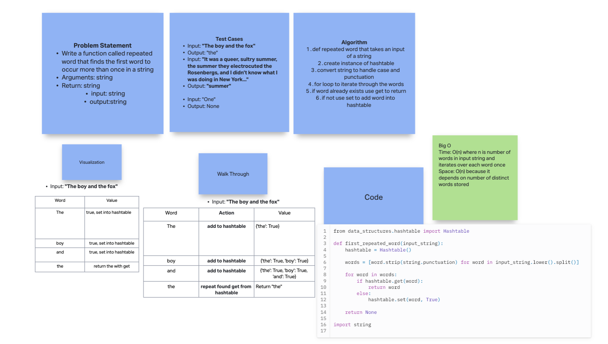

# Hashtable Repeated Word

Write a function called repeated word that finds the first word to occur more than once in a string
    - Arguments: string
    - Return: string

## Whiteboard Process

  <!-- Embedded whiteboard image -->

  

## Approach & Efficiency

  1. Write out problem statement
  2. reviewed what hashtable import did
  3. write test cases
  4. loop through words in string
  5. add to hashtable if distinct, get and return if repeated
  6. The Big O Time: O(n) where n is number of words in input string and iterates over each word once. Space: O(n) because it depends on number of distinct words stored

## Solution

[Solution](../../code_challenges/hashtable_repeated_word.py)

