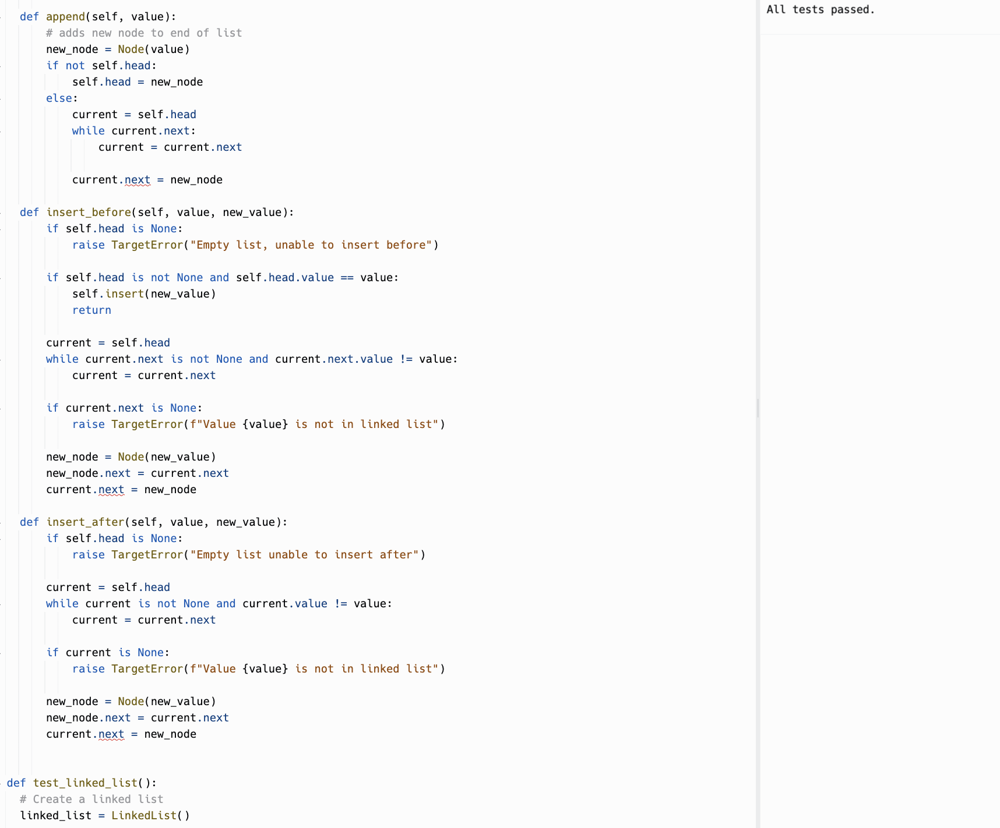

 # Linked List Insertions

Write the following methods for the Linked List class:

- append
  - arguments: new value
  - adds a new node with the given value to the end of the list
- insert before
  - arguments: value, new value
  - adds a new node with the given new value immediately before the first node that has the value specified
- insert after
  - arguments: value, new value
  - adds a new node with the given new value immediately after the first node that has the value specified

  ## Whiteboard Process

  <!-- Embedded whiteboard image -->

  

  ## Approach & Efficiency

  1. Write out problem statement
  2. Then wrote a function that would that array as argument
  3. Initialize two variables start and end
  4. While loop that runs as long as start is less than end
  5. Return array
  6. The Big O time is O(N) and space is O(1)

  ## Solution

  

  [Link to code](https://replit.com/@XinDeng/code-challenges-401)
