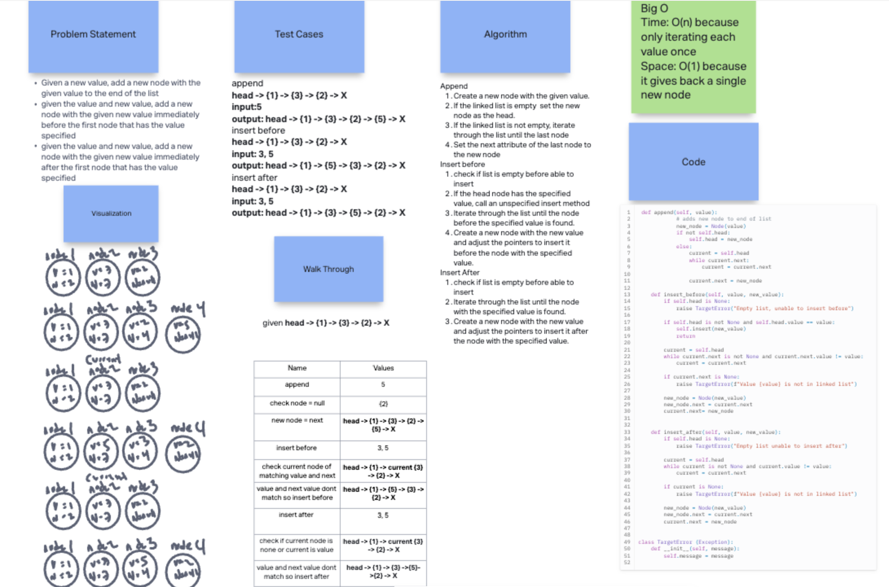

 # Linked List Insertions

Write the following methods for the Linked List class:

- append
  - arguments: new value
  - adds a new node with the given value to the end of the list
- insert before
  - arguments: value, new value
  - adds a new node with the given new value immediately before the first node that has the value specified
- insert after
  - arguments: value, new value
  - adds a new node with the given new value immediately after the first node that has the value specified

  ## Whiteboard Process

  <!-- Embedded whiteboard image -->

  

  ## Approach & Efficiency

  1. Write out problem statement
  2. create append function
  3. create insert before function
  4. create insert after function
  5. used images as a guide and talked out algorithm
  6. The Big O time is O(N) because only iterating each value once and space is O(1) because it gives back a single new node

  ## Solution

[Link to code](../../data_structures/linked_list.py)

