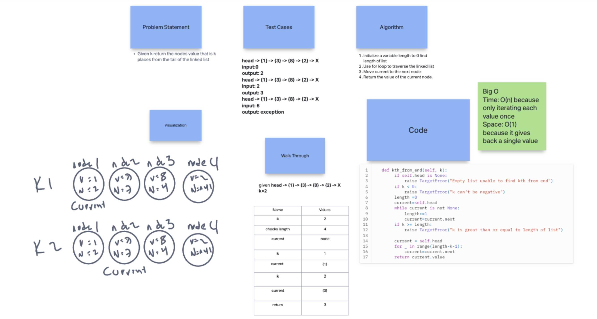
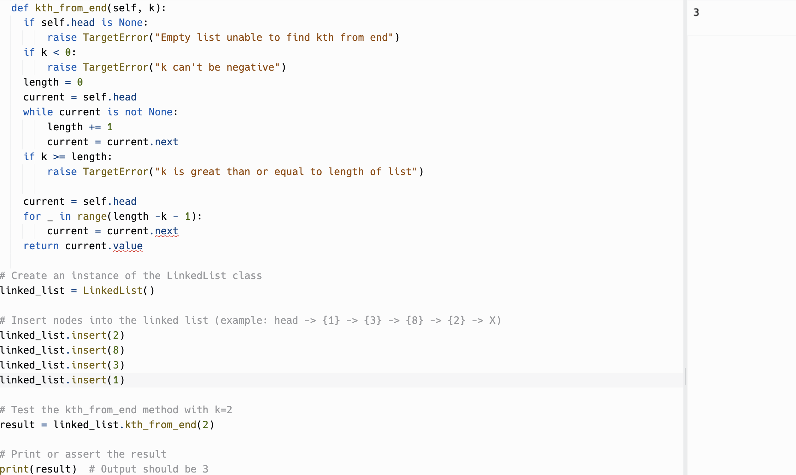

# Linked List Kth

Write the following methods for the Linked List class:

- kth from end
      - argument: a number, k, as a parameter.
      - Return the node’s value that is k places from the tail of the linked list.
      - You have access to the Node class and all the properties on the Linked List class as well as the methods created in previous challenges.

  ## Whiteboard Process

  <!-- Embedded whiteboard image -->

  

  ## Approach & Efficiency

  1. Write out problem statement
  2. drew it out first because I didn't get it
  3. create length count
  4. loop through it to move the current to k
  5. return value
  6. The Big O time is O(N) because only iterating each value once and space is O(1) because it gives back a single value

  ## Solution

  

  [Link to code](https://replit.com/@XinDeng/code-challenges-401)
