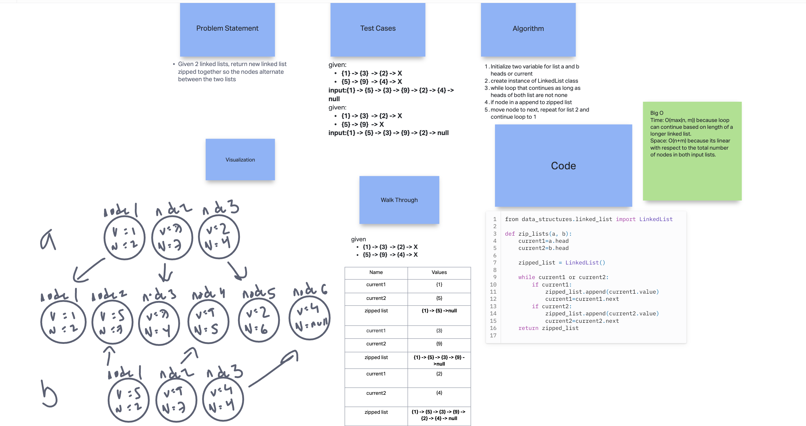
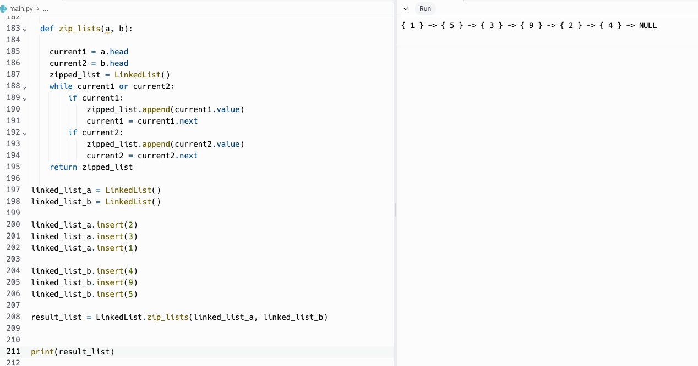

# Linked List Zip

Write the following methods for the Linked List class:

- Write a function called zip lists
- Arguments: 2 linked lists
- Return: New Linked List, zipped as noted below
- Zip the two linked lists together into one so that the nodes alternate between the two lists and return a reference to the the zipped list.
- Try and keep additional space down to O(1)

## Whiteboard Process

  <!-- Embedded whiteboard image -->

  

## Approach & Efficiency

  1. Write out problem statement
  2. drew it out first because I didn't get it
  3. looked through linked list code from before
  4. loop list one then two, repeat in that order
  5. append into new list to create zipped
  6. The Big O Time: O(max(n, m)) because loop can continue based on length of a longer linked list. Space: O(n+m) because its linear with respect to the total number of nodes in both input lists.

## Solution

  

  [Link to code](https://replit.com/@XinDeng/code-challenges-401)
