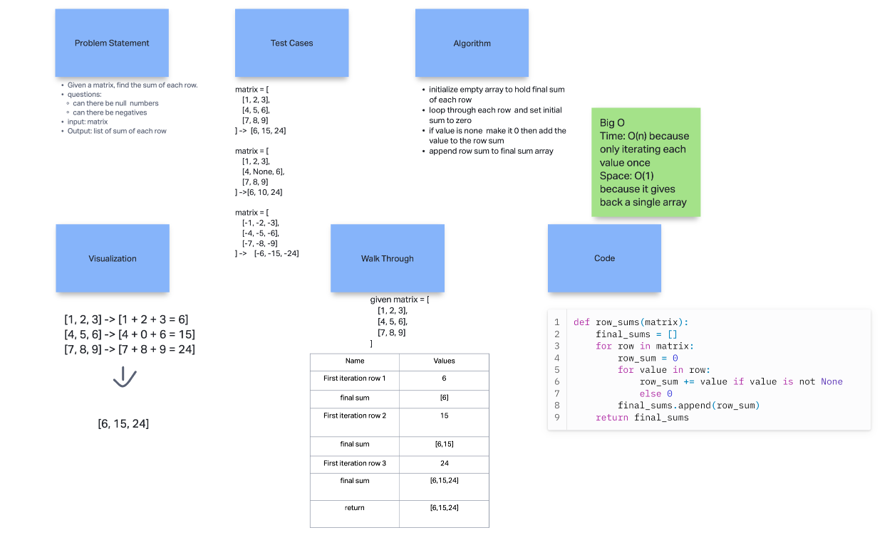
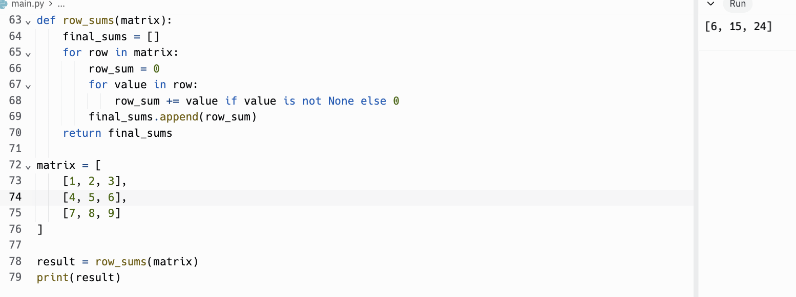

# Matrix - Mock Interview: Optional

- Given a matrix, find the sum of each row. write a function to add up the sum of each row in a matrix of arbitrary size, and return an array with the appropriate values.

## Whiteboard Process
<!-- Embedded whiteboard image -->

## Approach & Efficiency

1. Write out problem statement
2. wrote test cases with given and output
3. drew image and then talked out loud what the possible algorithm is
4. wrote algorithm that follows basic test case
5. wrote solution on replit
6. The Big O time is O(n) and space is O(1) because it's only going through each row once and returning one array

## Solution

[Link to code](https://replit.com/@XinDeng/code-challenges-401)
