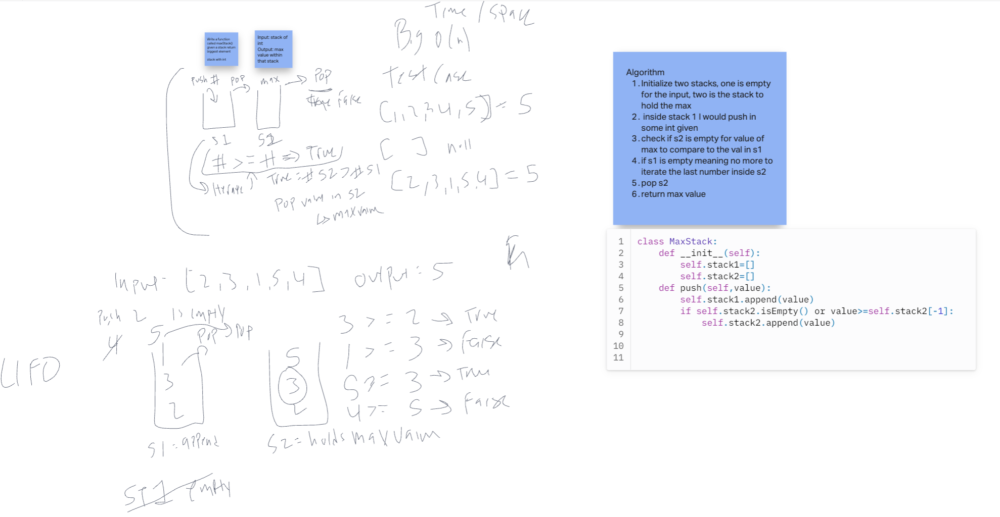

# Max Stack - Mock Interview

- Write a method that returns the “biggest” element in a stack.

1. Ask the candidate to write a ‘Max Stack’ which is defined as a Stack with an additional getMax() member function which returns the ‘biggest’ element in the Stack.
2. The candidate can assume that only numeric values will be stored in the Stack, but she/he has to ask before the interviewer can state this.
3. The internal memory of the Stack can be approached in different ways.
    - Using a Linked List
        - This approach uses O(n) space.
    - Using an Array
        - This approach can either use O(n) space or O(c) where c is the size of the array in static-size arrays.
        - If your language doesn’t support dynamic arrays,Inquire about the candidate’s decision of using a limited amount of storage for the Stack.
    - Using a Node class and manually creating connections by maintaining a reference to the ‘top’ of the stack.
        - This approach uses O(n) space.
4. This ‘getMax()’ member function can be approached in several ways as well:
    - Modifying the traditional push and pop methods to keep track on the maximum value so far.
    - Use a maxStack instance variable, and each time you push a number, you check if it’s >= the peek on maxStack; if so, push it onto both maxStack and the actual stack. Then when popping, check if equal to max on maxStack, and if so, also pop maxStack.
        - This solution takes O(1) time to both maintain and retrieve the maximum value.
    - Traversing the entire Stack to calculate the maximum value.
        - This solution takes O(n) time.
        - If the candidate is considering this approach, comment on the fact that there might be a more efficient way to calculate the maximum value, but avoid providing specific details.

## Whiteboard Process
<!-- Embedded whiteboard image -->

## Approach & Efficiency

1. Write out problem statement
2. drew image and then talked out loud what the possible algorithm is
3. did a walk through with a test case
5. wrote algorithm and solution
6. The Big O time is O(n) and space is O(n) because it depends on length of input

## Solution

[Solution](solution14.py)
