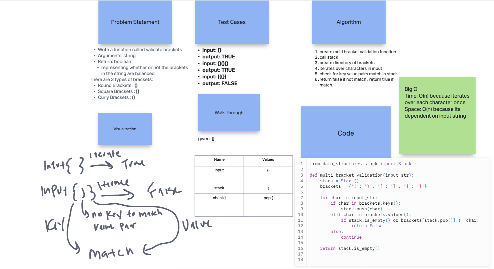
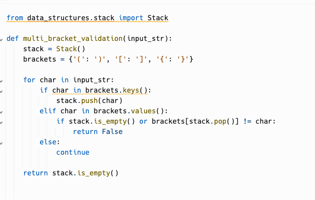

# Stack Queue Brackets

Create a class called AnimalShelter which holds only dogs and cats.

- The shelter operates using a first-in, first-out approach.
- Implement the following methods:

  - enqueue
    - Arguments: animal
    - animal can be either a dog or a cat object.
    - It must have a species property that is either "cat" or "dog"
    - It must have a name property that is a string.
  - dequeue
    - Arguments: pref
    - pref can be either "dog" or "cat"
    - Return: either a dog or a cat, based on preference.
    - If pref is not "dog" or "cat" then return null.

## Whiteboard Process

  <!-- Embedded whiteboard image -->

  

## Approach & Efficiency

  1. Write out problem statement
  2. drew it out first because I didn't get it
  3. looked at pseudoqueue code for help
  4. create enqueue function that has argument of animal if name matches dog/cat then enqueue
  5. create dequeue function that has argument of pref if pref matches dog or cat, check if empty then dequeue

  6. The Big O time is O(1) for enqueue because its just adding to list. O(n) for dequeue because it needs to check for empty Space: O(n) because each animal is stored in own queue

## Solution

  

  [Link to code](https://replit.com/@XinDeng/code-challenges-401)
