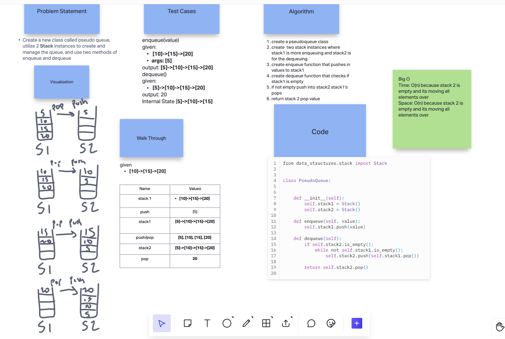
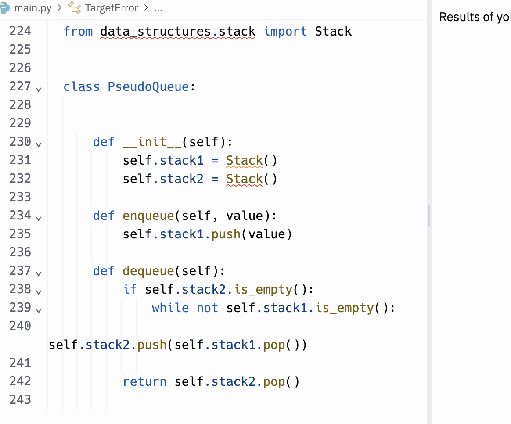

# Stack Queue Pseudo

1. Create a new class called pseudo queue.
    - Do not use an existing Queue.
    - Instead, this PseudoQueue class will implement our standard queue interface (the two methods listed below),
    - Internally, utilize 2 Stack instances to create and manage the queue
2. Methods:
    - enqueue
        - Arguments: value
        - Inserts a value into the PseudoQueue, using a first-in, first-out approach.
    - dequeue
        - Arguments: none
        - Extracts a value from the PseudoQueue, using a first-in, first-out approach.
3. NOTE: The Stack instances have only push, pop, and peek methods. You should use your own Stack implementation. Instantiate these Stack objects in your PseudoQueue constructor.

## Whiteboard Process
<!-- Embedded whiteboard image -->

## Approach & Efficiency

1. Write out problem statement
2. drew out stack and queue lifo/fifo to understand
3. talked out what the drawing is doing and write algorithm
4. write the code
5. The Big O time and space is O(n) because stack 2 is empty and its moving all elements over from stack 1

## Solution

[Link to code](https://replit.com/@XinDeng/code-challenges-401)
