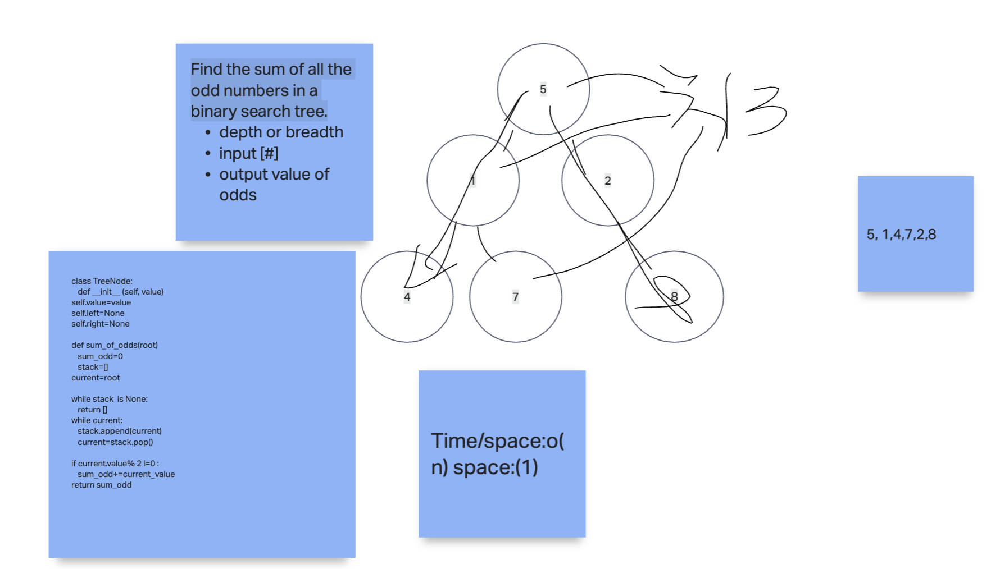

# Sum of Numbers in a Binary Tree - Mock Interview

1. Find the sum of all the odd numbers in a binary search tree.
    - Any of the traversals (depth or breadth) are acceptable.

## Whiteboard Process
<!-- Embedded whiteboard image -->

## Approach & Efficiency

1. Write out problem statement
2. drew image and then talked out loud what the possible algorithm is
3. did a walk through with a test case
5. wrote algorithm and solution
6. The Big O time is O(n) and space is O(n) because it depends on length of input

## Solution

[Solution](solution19.py)
