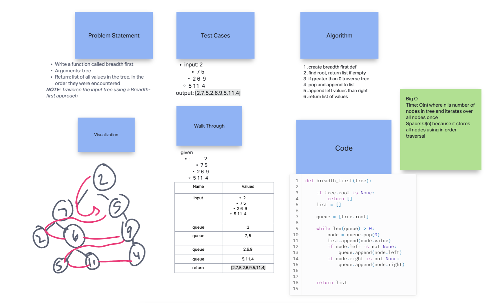
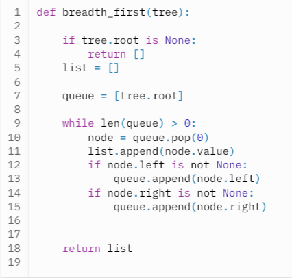

# Tree Breadth First

Write a function called breadth first

- Arguments: tree
- Return: list of all values in the tree, in the order they were encountered
- NOTE: Traverse the input tree using a Breadth-first approach

## Whiteboard Process

  <!-- Embedded whiteboard image -->

## Approach & Efficiency

1. Write out problem statement
2. drew it out first because I didn't get it
3. looked at binary tree code for help
4. create breadth first function
5. use queue, pop and append to list
6. return list
7. The Big O time is O(n) where n is number of nodes in tree and iterates over all nodes once. Space: O(n) because it stores all nodes using in order traversal

## Solution

[Link to code](https://replit.com/@XinDeng/code-challenges-401)
