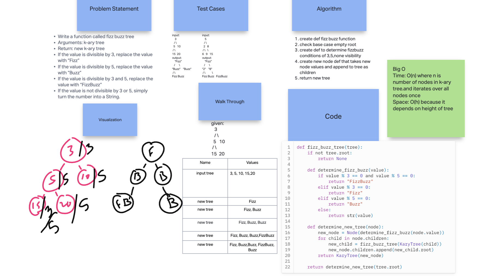

# Tree K-ary Fizz Buzz

Write a function called fizz buzz tree
    - Arguments: k-ary tree
    - Return: new k-ary tree
    - If the value is divisible by 3, replace the value with “Fizz”
    - If the value is divisible by 5, replace the value with “Buzz”
    - If the value is divisible by 3 and 5, replace the value with “FizzBuzz”
    - If the value is not divisible by 3 or 5, simply turn the number into a String.

## Whiteboard Process

  <!-- Embedded whiteboard image -->

## Approach & Efficiency

1. Write out problem statement
2. drew it out first because I didn't get it
3. looked at binary tree, kary code for help
4. create def to determine fizzbuzz conditions of 3,5,none visibility
5. create new node def that takes new node values and append to tree as children
6. return new tree 

7. The Big O time is O(n) where n is number of nodes in kary tree and iterates over all nodes once. Space: O(h) because it depends on height of tree

## Solution

[Link to code](https://replit.com/@XinDeng/code-challenges-401)
