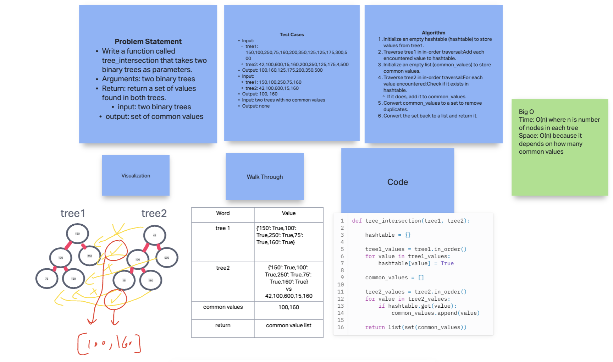

# Tree Max

Write a function called tree_intersection that takes two binary trees as parameters.

- Using your Hashmap implementation as a part of your algorithm, return a set of values found in both trees.

## Whiteboard Process

  <!-- Embedded whiteboard image -->

## Approach & Efficiency

1. Write out problem statement
2. drew it out first because I didn't get it
3. asked gpt for code first and worked backwards
4. The Big O time is O(n) where n is number of nodes in each tree. Space: O(n) because it depends on how many common values.

## Solution

[Solution](../../code_challenges/tree_intersection.py)

