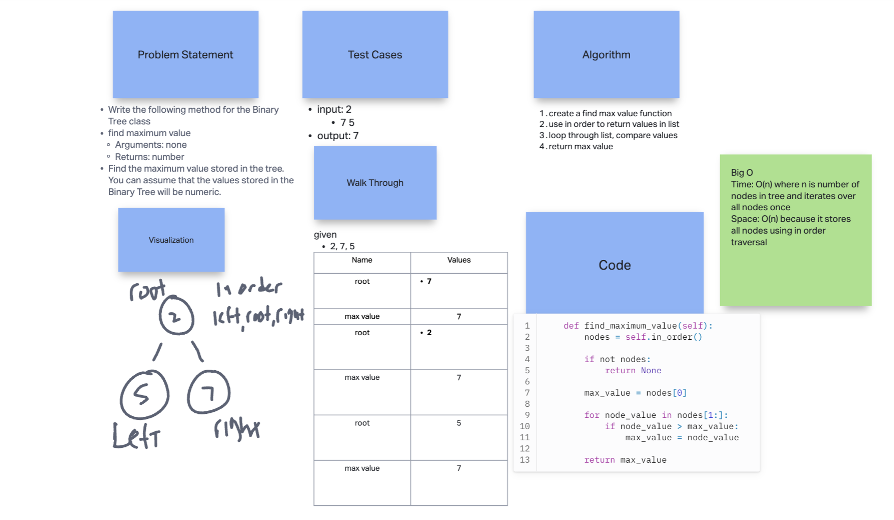
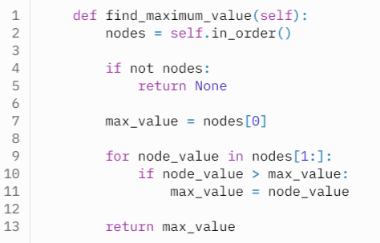

# Tree Max

Write the following method for the Binary Tree class

- find maximum value

  - Arguments: none
  - Returns: number
  - Find the maximum value stored in the tree. You can assume that the values stored in the Binary Tree will be numeric.

## Whiteboard Process

  <!-- Embedded whiteboard image -->

  

## Approach & Efficiency

  1. Write out problem statement
  2. drew it out first because I didn't get it
  3. looked at binary tree code for help
  4. create find max function
  5. use in order to return list values and loop through them for comparison 

  6. The Big O time is O(n) where n is number of nodes in tree and iterates over all nodes once. Space: O(n) because it stores all nodes using in order traversal

## Solution

  

  [Link to code](https://replit.com/@XinDeng/code-challenges-401)
